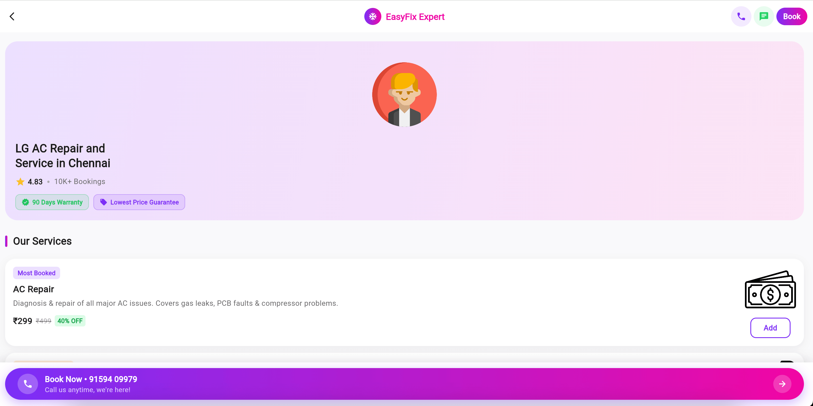
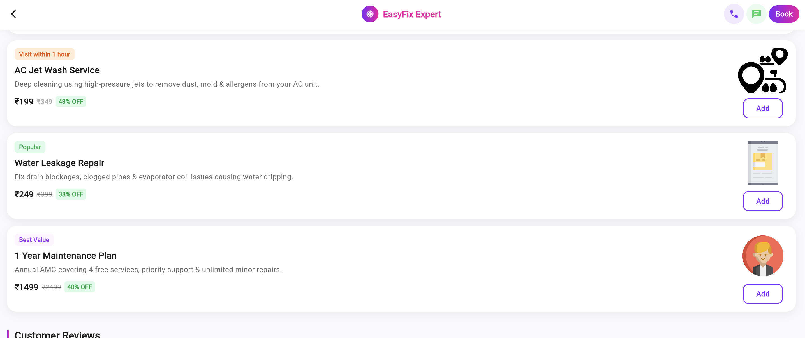
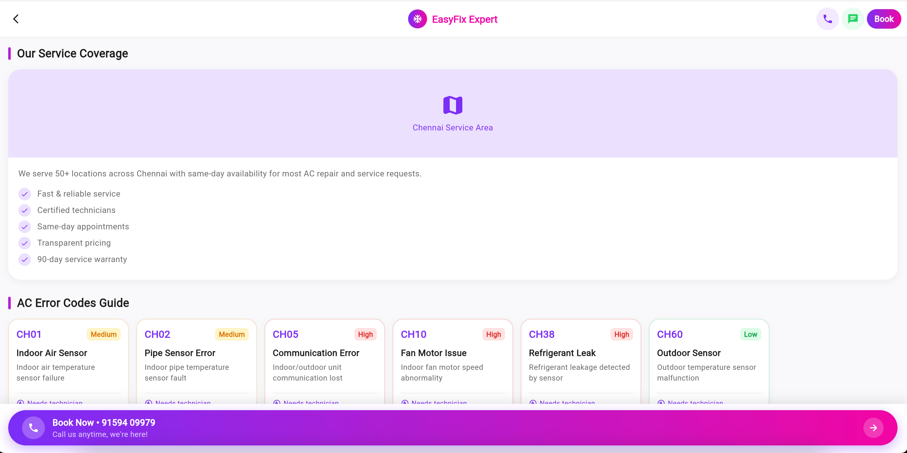
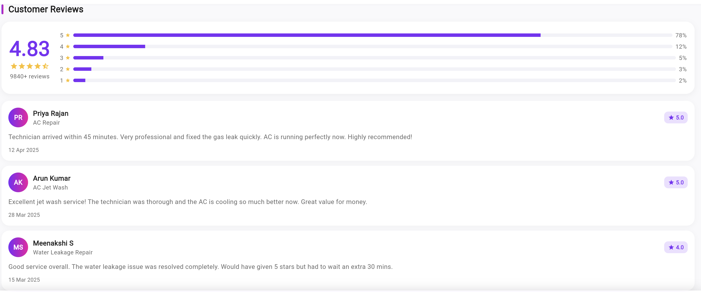
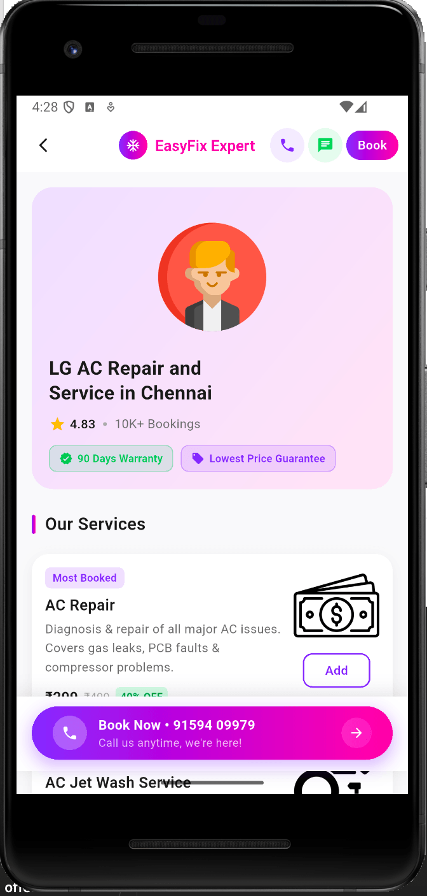
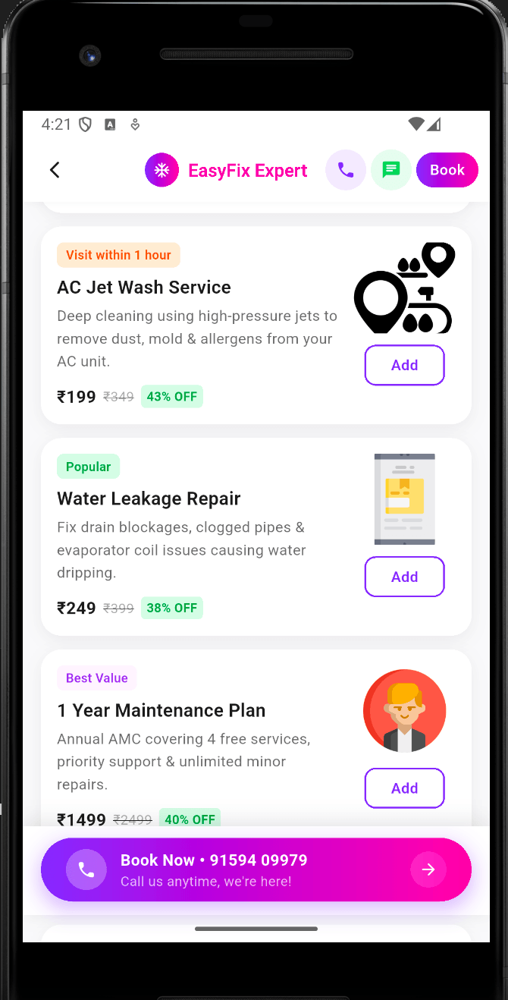
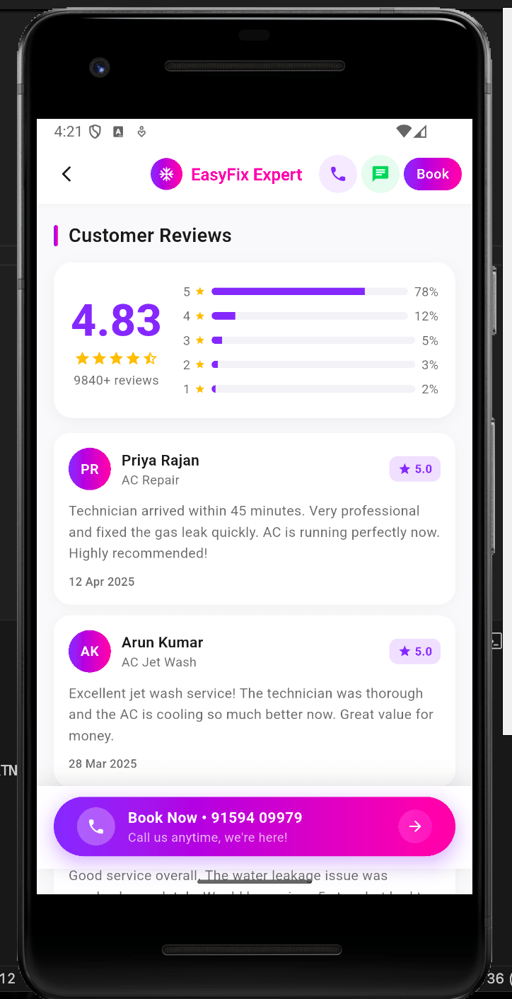
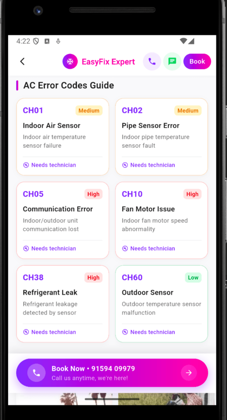
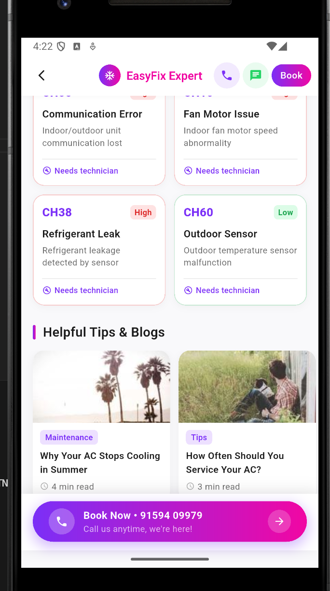

#  EasyFix Expert – Home Appliance Service Booking UI

A Flutter-based UI implementation of a Home Appliance Service Booking screen, inspired by modern service platforms like Urban Company.

This project focuses on clean architecture, reusable widgets, and responsive design, ensuring scalability and maintainability.


## 📱 Preview-

### 💻 Web View
🧾  Layout

🛠️ Services Section

⚠️ Error Codes Section

⭐ Reviews Section


### 📱 Mobile View
🧾  Layout


🛠️ Services Section



⭐ Reviews Section



⚠️ Error Codes Section



📰 Blog Section



## 🎯 Objective

The goal of this task was to:

* Build a **single, production-quality Flutter screen**
* Follow **modular architecture**
* Use **reusable components**
* Maintain **clean and readable code structure**
* Ensure **responsive UI across web and mobile**
Responsive UI implemented for both Web and Mobile platforms.

---

## 🧱 Project Structure

```
lib/
│
├── screens/
│   └── home_screen.dart
│
├── widgets/
│   ├── service_card.dart
│   ├── error_code_card.dart
│   ├── review_card.dart
│   ├── section_header.dart
│   └── bottom_cta.dart
│
├── models/
│   ├── service_model.dart
│   └── error_code_model.dart
│
├── constants/
│   ├── colors.dart
│   ├── text_styles.dart
│   └── strings.dart
```

---

##  Key Components

### 1. Home Screen

* Built using `CustomScrollView` with Slivers
* Ensures smooth scrolling and better performance
* Sections are modular and independently reusable


### 2. Reusable Widgets

#### 🔹 ServiceCard

* Displays individual services (AC repair, jet wash, etc.)
* Includes pricing, tags, and CTA button
* Designed for scalability

#### 🔹 ErrorCodeCard

* Represents AC error codes with severity indicators
* Uses dynamic styling based on severity
* Optimized layout to prevent overflow issues

#### 🔹 ReviewCard

* Displays user reviews with rating breakdown

#### 🔹 SectionHeader

* Reusable heading for each section

#### 🔹 BottomCTA

* Sticky bottom call-to-action with gradient styling


## 🎨 Design System

### Colors

* Primary: Purple gradient theme
* Background: Light neutral (#F9F9FB)
* Cards: White with subtle shadows

### Typography

* Font: **Poppins (via Google Fonts)**
* Consistent text hierarchy using centralized styles

### Spacing & Layout

* Uniform padding and margins
* Rounded corners for modern UI
* Shadow usage for depth

---

## ⚙️ Technical Highlights

* ✅ **Responsive Grid Layout**

  * Implemented using `SliverGrid`
  * Adaptive layout for web and mobile

* ✅ **Clean Code Practices**

  * Separation of UI, models, and constants
  * Use of `const` constructors wherever possible

* ✅ **Scalable Architecture**

  * Modular widget structure
  * Easy to extend with backend integration

* ✅ **Performance-Oriented**

  * Used `SliverChildBuilderDelegate` for efficient rendering

---

## 🚧 Challenges & Solutions

### 1. Grid Spacing & Layout Issues

* **Problem:** Extra spacing on web and overflow on mobile
* **Solution:** Adjusted `childAspectRatio` and implemented responsive grid logic

---

### 2. Dynamic Content Handling

* **Problem:** Text overflow in cards
* **Solution:** Used `Flexible`, `maxLines`, and proper constraints

---

### 3. Cross-Platform Consistency

* **Problem:** UI looked different on web vs mobile
* **Solution:** Applied responsive layout strategies using screen width checks

---

## 🚀 Future Improvements

* Backend integration (API-based services)
* State management (Provider / Riverpod)
* Booking flow implementation
* Animations and micro-interactions
* Dark mode support

---

## 🧑‍💻 Tech Stack

* Flutter
* Dart
* Google Fonts

---

## 📌 Conclusion

This project demonstrates the ability to:

* Build scalable and maintainable Flutter UI
* Think in terms of reusable components
* Handle real-world UI challenges like responsiveness and layout constraints

---

## 📬 Contact
Gmail- aditya7405jain@gmail.com
LinkedIn-https://www.linkedin.com/in/aditya-bilala-jain-0b8244286/
